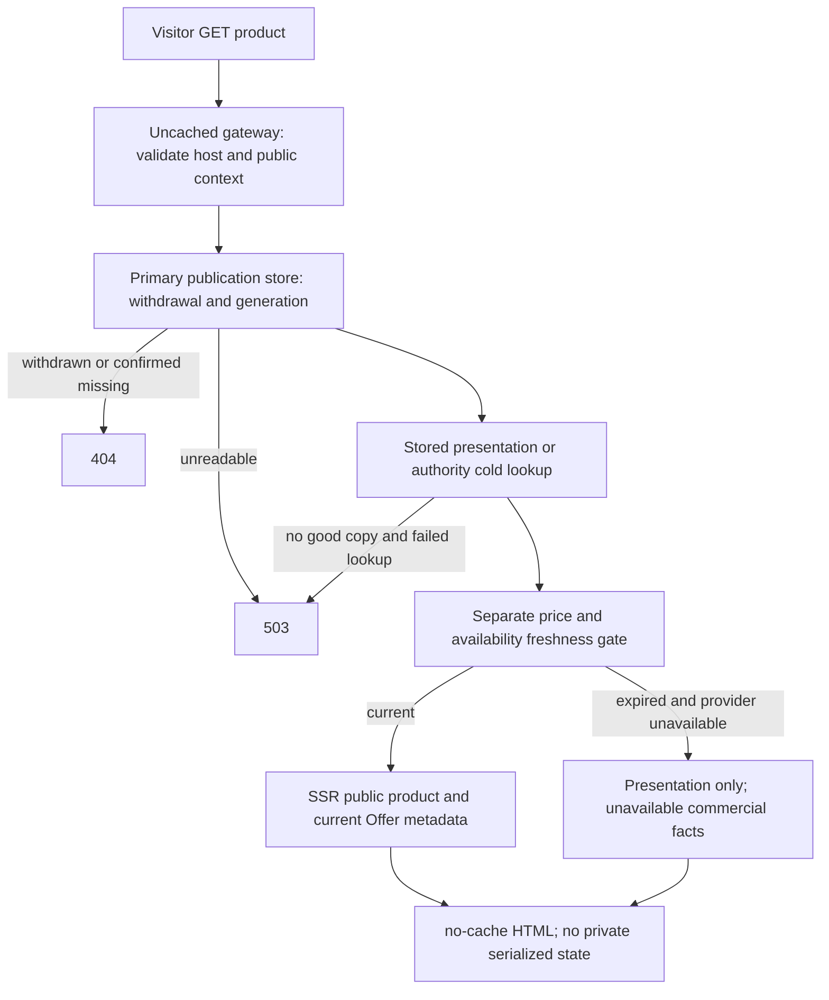
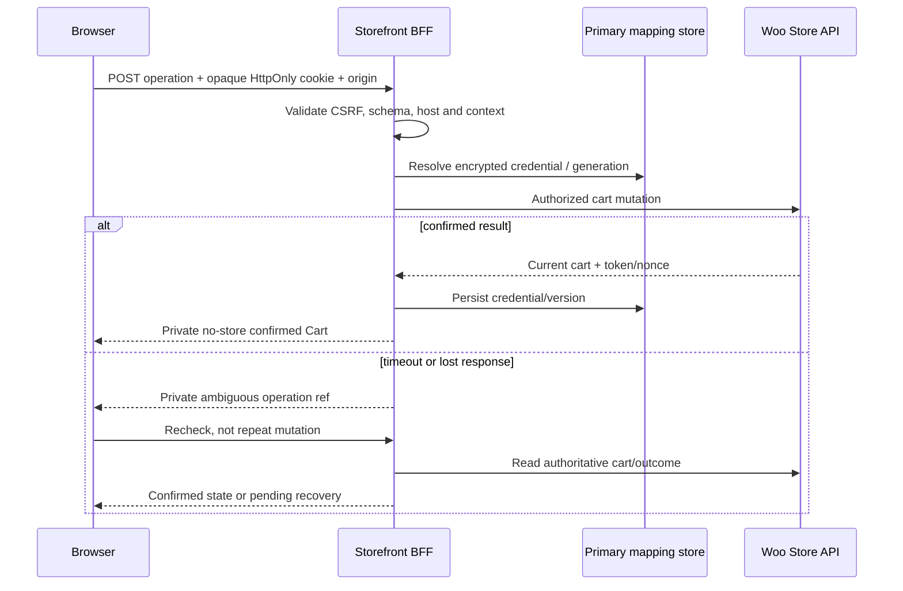
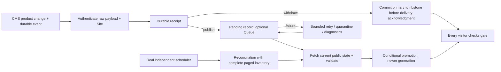

# Cloudflare + TanStack commerce architecture: the Ekis gap analysis

> Researched **2026-10-03** for [#50](https://github.com/Quick-Release/gq-site/issues/50), applying [#49's Decisions from grilling (2026-10-03)](https://github.com/Quick-Release/gq-site/issues/49) ahead of its original proposal. This follows [tanstack-storefront-blueprint.md](tanstack-storefront-blueprint.md), introduced by `fabfc22726ed836260ce60c4eb715753bfbf726f` (2026-10-03). It is research, not an ADR, production implementation, or permission to adopt Ekis.
>
> **#50 remains incomplete: the required deployed-Worker proof was not run.** Approval exists; accessible, safely scoped Cloudflare deployment/deletion credentials and an identified disposable account/budget do not. No Worker, store, tunnel, DNS record, or other runtime resource was created. The four live assertions remain **unverified**, not failed or passed. See [the proof plan](#one-live-proof-blocked-not-passed).

## Findings in brief

**Recommendation, not an accepted architecture:** retain Ekis's Start/Router/Query and same-origin BFF; WooCommerce remains the only commerce authority. Fix redirect handling, exact-money formatting, credential exposure, response status classification, and identity transitions before calling the storefront checkout-ready. Preserve native WordPress identity rather than adding a second account system. Generalise delivery/security policy into versioned modules, not managed business UI. #28 owns manifest/Frontend selection; #32 owns renderer API/home. [G1], [E1]–[E8], [I28], [I32].

The largest new finding is a **guarantee conflict**: shared cached product HTML cannot provide content-style immediate withdrawal if a hit bypasses the Worker. The current content implementation deliberately answers `no-cache`, reads primary D1, and refuses promotion under a withdrawal. Its guarantee begins when the Frontend acknowledges the withdrawal, not when an editor saves. A commerce equivalent needs that gate before every product response; an asynchronous Queue acknowledgment is not confirmation of public delivery. [G2], [G3], [C2], [C3].

**Named recommendation CART-CREDENTIAL:** move Cart-Token out of JavaScript `sessionStorage` into a **server-held, encrypted mapping**, addressed by a random HttpOnly `__Host-` cart-session cookie. Keep the existing encrypted WordPress login envelope separate. D1 primary reads are the minimal proposed store; add coordination only if concurrent mutation tests earn it. This adds storage/cleanup/fail-closed responsibilities and changes Ekis ADR0005's browser transport, but not WordPress identity authority. It is a recommendation pending proof and grilling, not a change to Ekis. [E3], [E4], [W2], [W3], [C5].

**Checkout recommendation:** conditional headless checkout, settled **with GQ eCommerce gateway work**. Retain Ekis's UI investment only if each required gateway meets the contract below. Otherwise provide a proven, short-lived, single-use WooCommerce-native handoff. Do not treat bacs/cheque/cod success or the redirect stub as payment compatibility evidence. This narrows the previous note's native-checkout-first candidate rather than reversing commerce authority. [I49], [I50], [E5], [W4], [W5].

## Evidence discipline and inspected baseline

Every as-built or upstream fact below carries a source key. All source retrieval/inspection dates are **2026-10-03**, unless a historical date is expressly given. Design rules, budgets and slice recommendations are labelled **proposed**; they are not factual claims about deployed behaviour.

- **D — documentary:** issue decisions, ADRs, committed code, published API documentation/source. Code presence does not prove deployment or compatibility.
- **M — mocked:** inspected tests using fake fetch, QueryClients or SQLite-backed D1. They describe intended assertions; **none were executed in this research**.
- **L — live-runtime:** actual deployed Worker HTTP observations backed by a throwaway WooCommerce store. **There are none.** The local tooling preflight is not commerce L evidence.

| Inspected source | Exact revision and date | Evidence and scope |
| --- | --- | --- |
| gq-site checkout | `2603ad12720ee70fcab4575fb7a1f3a24f07f30a`, committed 2026-10-03 | D: glossary, ADRs, ownership, content implementation/tests, generation/deploy seams. This is the pre-deliverable HEAD, not the commit subsequently containing this note. |
| Previous research | `fabfc22726ed836260ce60c4eb715753bfbf726f`, committed 2026-10-03 | D: Start/Router/Query, Woo first, Frontend-selector hypothesis and Alchemy-first deployment baseline. Read the complete note. |
| Ekis default branch | `ce258d86b7a9cb9b55e9d362e55a038162ce2316`, committed 2026-09-27 | D/M: read-only checkout outside gq-site; `apps/frontend`, lockfiles, infra, ADRs0002–0007 and selected tests. No Ekis file changed. |
| Ekis customizer decision branch | `93fe09bb731734678d411d2fa8100f4d5966c161`, committed 2026-09-29 | D: `docs/product-customizer-decisions`, ADR0008 `product-customizer-ownership`; inspected using `git show`, not merged into the default branch. |
| Capacity research #24 | `3c73ffaf5508811a47b294a07503b6f6d408cb51`, committed 2026-10-02 | D: `research/fleet-capacity:docs/research/fleet-capacity.md`; historical measurements/limits, not new live counts. |
| TanStack Router source/docs | `1f0f20a3206a28365d74fd2485b9a8eedbf74dd0` | D: official raw Markdown fallback after tanstack.com returned HTTP500; Start overview, Query guide, Router overview/external-data loading. |
| TanStack Query docs | `c074a13ddbef5549aad0410a41ceeceac696321d` | D: official raw SSR guide fallback. Moving-main page reads were accompanied by these revision observations; not a deployed library pin. |
| WooCommerce token/cart source | release tag `11.1.2` | D: `CartTokenUtils`, Store API `SessionHandler`, `Authentication`, `WC_Cart_Session`; matches Ekis Composer lock, not confirmation of installed production version. |
| GitHub tickets | #50/#49 **including all comments**, #28/#18/#32/#24/#35/#26/#30/#31/#38 and ekis#15 | D: retrieved with `gh issue view --json title,body,comments`; scope precedence recorded above. No issue edits or comments published. |

### Ownership is not optional

The glossary defines a Site as its own repository, **CMS**, Frontend and data; ADR0001 rejects pooled deployments. `ownership.json` generates Ploi/CMS and Frontend deploy wiring, while application skeleton files are create-once and then Site-owned. Selecting `commerce` does not select a different Frontend source today. #28's comments specifically warn that managed Astro deploy wiring would be put over Ekis's Start app; ordinary sync is **not** permission to overwrite its existing `apps/frontend` source. [G1], [I28].

**Proposed split:** Blueprint manages validated generation/build/deploy defaults and declared capabilities; shared runtime modules own commerce/session/delivery policy and version compatibility; provider packages own API translation; the Site owns routes, styling, adapter registry, customizer, business configuration and deploy extensions. Do not specify a registry/repository home here. Generation remains deterministic, offline and secret-free; resource creation and preparation are separate authorized steps. Never infer content capabilities merely from an app having a `migrations` directory. [G1], [G4], [I32].

**Open CMS-OPTIONAL:** Shopify would not naturally need Bedrock/Ploi, but a CMS-less Site conflicts with the current Site/CMS/Frontend definitions, `ownership.json`, CMS-first release and offboarding assumptions (ADR0011 expects a publication store). This requires explicit domain/manifest/operations work, not silently optional WordPress keys. It does not block the Woo-only proof. [G1], [G4], [I49].

## Ekis as built: keep / change / generalise

All Ekis behaviour in this matrix is **D at `ce258d…`**, except the separately identified ADR0008. “M” is inspected mock-test coverage, not a test run.

| Concern | As built / evidence | Risk or gap | Verdict for Blueprint |
| --- | --- | --- | --- |
| Runtime and framework | Start React/Vite app; `Cloudflare.Website.Vite` deploy; local Worker shim; shared renderer built before deploy. [E1] | Ekis beta.78 and generated Blueprint beta.79 are different graphs; no deployed proof here. | **Keep** Start; **generalise** tested platform-release pins and runtime health, not a copied deploy file. |
| SSR Query isolation | `getRouter()` constructs a new QueryClient; private meta excludes queries from dehydration. Root wraps `QueryClientProvider`, not the documented SSR Query integration. M isolation test creates two routers, fake auth clients and calls `dehydrate`; it does not stream HTTP HTML. [E2] | Router loader state still serialises separately; module-level commerce credential fallback is unsafe if used in SSR. | **Keep** request scope; **change** credential access to request-only server context; **generalise** one hydration strategy and live acceptance. |
| State ownership | Catalog reads in Router loaders and direct API helpers; private cart/auth in Query; cart key has no identity context. [E2], [E5], [E6] | Invalidating existing queries can display old customer data while a refetch fails. | **Change** identity epoch partition/removal; **generalise** shared query definitions, not two independently fresh copies. |
| Public layouts | ADR0004 separates normalized public layout from private commerce; ADR0002 framework-neutral contract/adapter seam. [E7] | Layout caching is not product delivery resilience; route facts, language fallback and price have separate lifetimes. | **Keep** separation; **generalise** bounded presentation delivery policy with #32, not React contract fields. |
| Product reads and outage behaviour | Direct Store API product collection/slug fetch; JSON cast, errors thrown for HTTP failure or empty product result. [E6] | No durable product presentation store; generic errors do not establish honest 404/503; no withdrawal gate. | **Change** validated missing/unavailable results; **generalise** last-known-good presentation/withdrawal/reconciliation. |
| Money | Minor-unit strings retained in interfaces; `formatStorePrice` and transactional formatter use `Number` and decimal division. [E5], [E6] | Binary rounding/large-value loss and defaulting precision to 2. | **Change** exact formatting; **generalise** provider-authoritative Money model below. |
| Cart transport | Token/Nonce response headers returned to browser; stored in sessionStorage plus module-level memory fallback. [E3], [E4] | XSS theft, per-tab loss; SSR module state risk; reuse after merge/expiry not proved. | **Change** to server-held mapping; **keep** no-store BFF; no invented native merge implementation. |
| Login/session | AES-GCM/HKDF envelope of native WP cookie, key ID/version/expiry, Secure HttpOnly SameSite=Lax `__Host-` cookie; previous keys supported. [E4], [E7] | Encryption is transport, not authorization; expiry must stay within WP expiry; cart mapping requires a separate rotation/cleanup policy. | **Keep** WP authority and codec; **generalise** lifecycle/rotation tests and current-user validation. |
| Login/cart transition | ADR0005 retains guest token for first logged-in refresh, relies on native saved-cart loading; clears transport on logout/reset/expiry. [E3], [E7] | Token session handler can retain guest session identity; saved-cart merge is not token revocation. Frontend mock tests don't prove old-token reuse safety. [W3] | **Change** transition gate and post-merge mapping rotation; prove native outcome before adoption. |
| BFF controls | Path/method allowlist; fixed upstream origin/path; redirects manual/rejected; request 256KiB / response 4MiB bounds; mutation origin/fetch-site checks; private headers; eight-second upstream-header timeout. [E3] | Top-level JSON object is not operation schema validation. Timeout is cleared after `fetch`, before body read, so body streaming can outlive deadline. Raw upstream error JSON/extensions returned. | **Keep** narrow transport; **change** full-operation deadline, runtime schemas, safe error/extension output. |
| Auth abuse controls | Start explicit CSRF middleware; strict BFF origin; Siteverify action/hostname, shared retry UUID; HMAC identifier/local rate bindings and WP fallback. [E4], [E8] | Local approximate rate counts are not global quotas; CSP lacks a restrictive script policy. | **Generalise** controls with plan/config checks; **change** CSP in gateway/UI-compatible rollout, not an assumed XSS cure. |
| Checkout | Private Store API POST; response model includes payment redirect, but UI always goes to local order confirmation using order ID/key. [E5] | Lost offsite/3DS redirect; order key in URL; ambiguous submission can be retried without confirmed outcome. | **Change** redirect/action state machine, protected confirmation reference, outcome reconciliation. |
| Account/orders | Native auth bridge; Store API order endpoint restricted to numeric ID/key and optional billing email; guest email saved in browser sessionStorage. [E3], [E5] | Store API isn't profile/order-history directory; URL/query logs can leak guest proofs. | **Keep** ownership authorization at WP; **change** browser-visible order proof handling; **generalise** explicit unsupported history. |
| SEO/markets | Product loader generates canonical from provider permalink or Site-specific fallback; locale adapter and optional language design metadata. [E6], [E7] | CMS permalink can be wrong public canonical; raw required data/status before streaming not formalised. No evidence of active multi-market selling. | **Change** canonical host allowlist/Frontend route derivation; **defer** market rollout pending requirements. |
| Catalog events | Ekis public-layout dependency invalidation is an ADR policy; inspected Frontend product helpers don't implement durable catalog events/reconciliation. [E6], [E7] | Cannot claim #38's delivery guarantee for products. | **Generalise** content lessons, not volatile price or private cart storage. |
| Customizer | Branch ADR0008: WP/Woo own price, validation, cart Design and immutable order-line snapshot; pure contract/SVG package; BFF pass-through. [E9] | Accepted design on a separate branch is not production implementation evidence. | **Keep** all authority boundaries and Site ownership; do not duplicate customizer pricing in commerce core. |
| Other ADRs | ADR0003 optional Polylang explicitly ahead of implementation; ADR0006 MU autoload proposal; ADR0007 exact-revision CI/observation gate. [E7] | Accepted/proposed/implemented status differs by document; CI verification is not shopper runtime proof. | **Keep** optionality, MU authority, exact-artifact identity; don't call all ADRs deployed. |

## TanStack and deployment delta

**D — locked Ekis versions:** Start **1.168.56**, Router **1.170.38**, Query **5.103.1**, React/DOM **19.3.0**, Vite+ **0.3.0**, Vite alias `@voidzero-dev/vite-plus-core` **0.3.0**, Vitest **4.1.11**, TypeScript **6.0.3**, Alchemy/frontend-frameworks **2.0.0-beta.78**, Effect **4.0.0-rc.115**. Manifest ranges are not these resolved pins. Ekis Composer locks WordPress **7.1.2** and WooCommerce **11.1.2**. None is a live installed-version observation. [E1].

**D — current maturity:** official Start overview still explicitly says **Release Candidate**, feature-complete/API-stable, not bug-free. Router is published v1 and Query v5; official SSR/integration guides are maintained, but the inspected docs establish no commercial SLA or LTS support window. Don't infer GA Start from a `1.x` number or promise patch support for Ekis's exact older versions. Adopt a tested lockfile and support/upgrade window per platform release. The earlier note's Start RC caveat is retained, not silently replaced. [T1], [T2], [T3].

| Library | Recommendation | Responsibility / simpler alternative |
| --- | --- | --- |
| Start | **Adopt baseline**, contingent runtime proof | SSR/streaming, server functions/routes and boundaries; hand-built SSR adds ownership without removing maturity risk. [T1] |
| Router | **Adopt baseline** | URL/search/validated filters/navigation/loaders; do not store another cart snapshot in Router. [T2] |
| Query | **Adopt baseline** | Remote data and mutation feedback; request-scoped server client, identity-partitioned browser client; Router-only reads are simpler for route-only resources. [T2], [T3] |
| Form | **Reject by default until a workload earns it** | Ekis uses ordinary input/React state; no proved need to add another library for forms. Accessible HTML + runtime server validation first. This supersedes #49's original core-candidate list per grilling. [E1], [I49] |
| Pacer, Store, Table, Virtual, DB, AI | **Reject by default** | No per-library experiment or dependency addition. React transient state, URL search, Query, normal lists and provider search are the baseline. AI/semantic search deferred. [I49], [I50] |

**Proposed state rules:** Router owns URL state; Query owns fetched remote state; React owns unfinished input/preview (Form only when earned). Share `queryOptions` between loader `ensureQueryData` and component reads; Router preload freshness delegates to Query for those resources. Await product identity/existence, withdrawal gate and required metadata before streaming; stream reviews/recommendations only if optional. Private customer/cart reads can be client-only initially; if SSR is later needed, request-authorise and deliberately omit private dehydration. `meta.private` does not remove secrets from loader data, markup, logs or query errors. Query keys: resource + Site + locale + market/currency/tax/pricing context + normalized filters; private keys also carry a non-secret session epoch, never a token. Remove old private cache on login/logout/account switch, cancel in-flight queries, rotate epoch and refetch before revealing private UI. [E2], [T2], [T3].

**D — Workers support path:** Cloudflare's official Vite guide uses Cloudflare Vite plugin (SSR environment), Start plugin, React plugin, Worker server entry and compatibility configuration. Alchemy's own guide instead uses `Cloudflare.Website.Vite` and removes the direct Cloudflare plugin. Don't combine two owners of the Worker build. SSR/server functions/assets/bindings must be tested with the actual chosen graph; Node compatibility is not permission to depend on a filesystem or a Node server at request time. [C1], [A1].

**Proposed release gate:** try the pinned Alchemy path already used by Ekis; compare generated beta.79 only as a separate graph. Build once; test emitted Worker asset routing, cold direct URL SSR, hydration/navigation, lazy bindings, streaming and secrets; promote the identical artifact. If a Wrangler-only throwaway proof is used, label that narrower outcome: it does not verify managed Alchemy CI. Production remains one deployment owner. #30/#31 govern code rollback/data recovery; rolling back code must never restore older orders. [G4], [I30], [I31].

## Commerce contract: small, server-side, not a second backend

**Proposed interface**, derived from Store API surfaces [W1]–[W6], desk-checked against [S1]–[S5]. Browser inputs cannot select a Site, upstream host, customer ID, authoritative totals or token. Server context resolves deployment Site, allowed canonical host, locale, supported market and verified principal/cart mapping.

```ts
// Design notation, not implementation or accepted package API.
type Money = { minor: string; currency: string; precision: number }
type Freshness = {
  observedAt: string; currentUntil?: string; sourceVersion?: string
  state: 'current' | 'last-known-good' | 'unavailable'
}
type CommerceError = {
  kind: 'missing' | 'unavailable' | 'invalid' | 'unauthorised'
    | 'forbidden' | 'conflict' | 'rate-limited' | 'unsupported'
    | 'ambiguous'
  retryable: boolean; correlationId: string
  // safe, allowlisted field errors only; no raw provider body
}
type CheckoutHandoff =
  | { kind: 'redirect'; destination: string; attemptRef: string }
  | { kind: 'awaiting-confirmation'; attemptRef: string }
  | { kind: 'confirmed-order'; attemptRef: string; order: OrderSummary }
// confirmed-order is NOT necessarily paid.
```

- `Product`: opaque provider-qualified ID, slug/Frontend canonical route, validated title/description/media, options and Variant references, public visibility and presentation freshness. `Variant`: opaque purchasable ID/options, explicit purchasability, price and availability freshness; never infer stock count from a boolean. `Collection`: opaque category/collection reference, label and memberships where supported. Render HTML only through reviewed sanitization/contract renderers; a TypeScript cast is not validation. [W1], [E6].
- `Cart`: opaque client-safe reference (not credential), revision/observation, lines, provider-confirmed totals/discounts/tax/shipping, selected delivery options, warnings and requirements. `CartLine`: provider line reference + purchasable reference + quantity/limits + supported customization snapshot reference + provider totals. Totals can change at checkout. [W2], [W4], [S1].
- `Customer`: verified shopper reference and minimal allowlisted profile. `OrderSummary`: opaque reference, order date, provider total and **separate** order/payment/fulfilment status; mapped states include pending, awaiting-payment/on-hold, processing, paid-confirmed, cancelled, failed, refunded, unknown. Preserve a provider-specific diagnostic status internally rather than coercing unknown into paid. No universal mapping from `processing` to independently verified settlement. [W4], [W6].
- Pagination: bounded page size; opaque continuation returned by the adapter. Woo page/X-WP-Total and Shopify cursors remain adapter details; continuation binds filters/context, has limits, and is not a snapshot-isolation promise. Slug absence is missing only after a valid successful authority response. [W1], [S2].
- Extension slots: named, versioned capability-specific schemas; no arbitrary pass-through blob in public contract. Cart add may carry Ekis Design unchanged through the BFF but Woo/customizer validates and prices it; reject unknown capability rather than lose order data. [E9].

| Operation | Woo first mapping (D) | Contract / failure rule (proposed) |
| --- | --- | --- |
| `catalog.getProduct/listProducts/search` | Store `/products`, slug/filters/search, published shopper surface. [W1] | Public presentation + independently fresh price/availability; missing vs unavailable; no privileged key. |
| `catalog.getCollection` | Store product categories/taxonomies, adapter-specific supported subset. [W1] | Explicit category-vs-curated-collection capability, not an identical provider ontology. |
| `cart.create/get` | GET `/cart` issues Cart-Token; subsequent private cart identity resolved server-side. [W2] | GET may bootstrap session; private no-store and never speculative shared prefetch. |
| `cart.addItems/updateItems/removeItems` | add/update/remove-item endpoints; variation IDs/attributes and line keys. [W2] | Validate quantities/references; return authority-confirmed complete cart. Bulk method can sequence operations but must expose partial success, not promise atomic batches. |
| `cart.applyDiscount/removeDiscount` | apply/remove-coupon. [W2] | Explicit unsupported discount kinds; coupon error is not transport unavailable. |
| `cart.updateCustomer/selectDelivery` | update-customer/select-shipping-rate. [W2] | Required ancillary capabilities to actually check out shipping carts; addresses remain private. |
| `checkout.begin` | POST `/checkout`; draft-order GET is not pure preload. [W4] | Return handoff/pending/confirmed order, never invented paid success; expected-total conflict if installed version supports it. |
| `customers.getProfile/getOrders` | Native WP bridge for profile; Store API **does not supply general order history**. Narrow `/order/:id` has ownership/guest proofs. [E4], [W6] | `unsupported` until owned authenticated bridge is proven. A wc/v3 service key requires least privilege plus server-derived customer ownership, not a browser ID filter. |

### Exact money and freshness

**Proposed canonical representation:** integer minor-unit **string**, ISO currency and explicit precision; e.g. `{minor:'12345',currency:'EUR',precision:2}` displays `123.45`, precision 0 displays an integer, precision 3 inserts three fractional digits. This is a precision-explicit refinement of the prior note's exact decimal string, not a frontend total calculator. Woo Store API minor-unit strings differ from wc/v3 decimal strings and from Shopify MoneyV2's Decimal + currency. Parse strings by digits/sign and decimal placement; use BigInt only internally if needed; JSON remains strings. Reject missing/invalid precision or inexact conversion; never silently round, default to two decimals, apply FX or sum a checkout total locally. Preserve high-precision Woo `raw_prices` separately if needed; they are not the same as display totals. [W1], [W2], [S3], [E6].

**Proposed freshness contract:** observation time records a complete validated provider read, not a cache hit; `currentUntil` records a business-approved bound. Separate records for title/media/description, price and availability. Price context includes currency, tax display, discounts and customer segment where applicable. The previous note's Query 30-second defaults and #49's 30–120s edge suggestions are not approved commercial freshness guarantees. [E2], [I49].

**Candidate test budget only:** approve a maximum **30 seconds** for anonymous display price/availability before enabling display reuse; zero extra stale-while-revalidate/stale-if-error beyond that bound. If not approved, use request-time authority reads. On expiry/failure show presentation with “price/availability temporarily unavailable”, omit Offer price/stock structured data and disable purchasing affordance, or return 503 if the page cannot honestly stand alone. Cart/add/checkout **always** revalidate at Woo; no freshness window turns a display price into transaction authority. Product presentation can remain last-known-good without age limit only after durable delivery/withdrawal/media prerequisites hold. [G2], [W2], [W4].

## Content guarantees carried over — with explicit limits

| Guarantee | Content fact (D/M) | Proposed commerce interpretation / gap |
| --- | --- | --- |
| Last-known-good content | Complete valid promotions persist in D1 across outages; no age limit. [G2], [G3] | Product presentation can follow it; full volatile Store API JSON cannot. Ekis does not implement this today. |
| Withdrawal precedence | Signed event commits withdrawal, all known routes 404; promotions check tombstone in SQL; same-time withdrawal wins. [G2], [G3] | Product/publication bridge must cover product/variation visibility, password/privacy, moves and deletion; a hidden parent must not leave purchasable children exposed. Store API docs expose some password-protected product information: apply stricter public policy where necessary. [W1] |
| Immediate 404 | Every visit reaches primary D1; no shared HTML cache in front. [G2] | Guarantee starts **after committed acknowledgment**. Unknown/missed event + CMS outage cannot reveal a withdrawal; accepted limitation, not an invented guarantee. |
| Missing vs unavailable | Valid authority absence gives 404; failed read/no usable state gives 503; store outage fails closed. [G2], [G3] | Empty/failed parse is not missing. Withdrawn 404 remains even if price source fails. Store unreadable must not fall back to a live read that could resurrect withdrawn content. |
| Refresh | Complete, valid read only; failed/partial read keeps stored state. [G2], [G3] | Separate presentation, price and availability schema/epochs; never promote an error, incomplete variant set, or private context as public. |
| Reconciliation | CMS real cron invokes signed comparison every minute; five-minute healthy-dependency target; incomplete enumeration withdraws nothing. [G2], [G3] | Add product inventory of **public identities/versions**, deletion ledger and interrupted-scan checkpoint. Catalogue enumeration/search is not transaction inventory reservation. |
| Independent media | R2 upload path required for content readiness. [G2] | Provider-hosted media may remain until its outage behaviour is acceptable; don't claim page resilience guarantees independent images without verifying hosting. Reuse R2 path for owned assets. |

Use **publication store** for the durable public presentation copy; do not coin “catalog projection” merely to rename the same guarantee. A future **catalog projection** is different only when it adds rebuildable search/facet/membership indexes: it remains public/rebuildable and must honor the same withdrawal gate. Never store cart totals, orders or inventory as transactional truth there. [G2], [I49].

### Direct reads versus a stored copy

**Proposed first proof:** direct Woo catalog reads with honest 404/503, **no claim of content-style outage resilience**. **Proposed commerce release promising that resilience:** small durable presentation publication store, not an optional edge cache. This breaks the assumption that a direct-read-only initial release can inherit #38 automatically. Additional full search/catalog projection is optional. [G2], [E6].

| Choice | Benefit | Cost / measurable adoption trigger (proposed, not benchmark) |
| --- | --- | --- |
| Direct authority reads | Simplest, freshest observation, no catalog replication | If p95 required catalog read exceeds 300ms or catalog-source failure exceeds 0.1% over seven representative days, investigate durable read path/latency placement; thresholds need owner approval. |
| Durable presentation store | Required for unlimited outage fallback and durable withdrawal; schema-valid public copy | Events/scheduler/bootstrap/store-primary latency and media independence become readiness prerequisites. Adopt because of guarantee, not just traffic volume. |
| Rich catalog projection | Search/facets/aggregation without repeated provider calls | Add only if provider search fails agreed relevance/facet tests, read load consumes >50% of approved provider budget, or measured p95 misses page budget after simpler tuning. Record catalog size/update rate/index size and rebuild duration first. |

No claim is made that D1 FTS, an external search service or Cloudflare AI is needed now. Provider-native search first; later choose on measured relevance and load. [I49], [I50].

## Public/private delivery and actual Cloudflare cache semantics

**D — two different mechanisms:** the newer **Workers Cache** docs were fetched directly, not inherited as an assumption. It can serve before Worker execution, is Worker/entrypoint-owned, tiered, version-keyed by default, and keys path/query plus `ctx.props`, **not hostname**. Cookie is not an automatic key dimension; documented bypass mentions response Set-Cookie and request Authorization, not a blanket cookie-bearing request guarantee. `Vary` is supported there. `cache.enabled`/per-export configuration and `ctx.cache.purge` are documented; **compatibility of Ekis's pinned Alchemy/Wrangler build and actual account entitlement were not proved**. No separate cache price is documented beyond Workers requests/CPU on misses. [C2], [C3], [C4].

**D — purge scope/limits:** Workers Cache purges belong to the target Worker/entrypoint; there is no purge-by-host. Its docs say programmatic purges use **Free-tier purge rate limits regardless of zone/account plan**. Purging a cached inner entrypoint from an outer/consumer context must target the owner rather than assuming a zone purge or `caches.default.delete` reaches it. These operations and propagation are not a substitute for primary withdrawal gating. Exact rate entitlement/configuration must be checked before enabling them. [C2], [C3].

**D — Cache API** is explicitly code-driven, data-centre-local and not tiered; `cache.delete` is local, not global withdrawal delivery. It does not support `stale-while-revalidate`/`stale-if-error` directives as Workers Cache does. Cloudflare zone Cache-Control/Set-Cookie behaviours depend on origin-cache-control and rules; they cannot be imported as a universal Worker policy. Zone rules don't configure the new Worker's cache. [C2], [C4].

**Proposed safe default:** keep automatic caching **off on the outer default entrypoint**. Every request must validate host, classify session/private traffic and read any withdrawal/freshness gate **before** a public representation reuse. Cart/account/checkout/auth, mutations, credential-bearing requests and any response with Set-Cookie remain `private, no-store`; no public Query dehydration containing cart counts, names, addresses, customer prices, order proofs or credentials. Initially bypass **all cookies**, including unknown cookies, and Authorization; a later public-cookie allowlist requires evidence. Never strip Set-Cookie to force a personalised response into shared cache. [E3], [E7], [C2], [C3].

For immediate withdrawal, initially serve HTML `Cache-Control: no-cache` (private routes no-store) and don't enable public HTML hits before the gate. If internal cached presentation fragments are introduced, outer uncached code reads primary withdrawal/presentation generation, then invokes only a public inner entrypoint with trusted context and generation in its key. Such reuse must never serve stale price or bypass response-time withdrawn status; cache failures fall back to the durable copy, not transaction state. Whole rendered HTML reuse also requires bounded price observation age, separate freshness gate and all late streamed/dehydrated content audited. Purge is an optimisation, **not the withdrawal authority**. [G2], [C2], [C3].

| Key dimension | Proposed normalization and rule |
| --- | --- |
| Site + environment + deployment contract | Bound to isolated deployment/resources, never a caller-supplied Site switch; still explicit in internal context and event records. |
| Canonical host | Validate against allowlist **before cache**, canonicalize/redirect accepted aliases; reject unknown host (400/421 policy). Workers Cache omits host, so pass validated host in `ctx.props`/key if host changes output. |
| Locale/language | Requested/resolved locale, fallback state/provider if output varies; canonical route resolution and Query key must agree. |
| Market/currency/tax/pricing context | Only enabled capabilities; no frontend FX. Personalized pricing always private. Defaults are explicit, not omitted key dimensions. |
| Product/route + presentation generation | Includes withdrawal/republish generation and renderer/schema revision; prevents old public entry reuse after republication. |
| Query parameters | Validate allowed filters/search/sort/page, normalize order/defaults/encoding; bound lengths and cardinality. Remove tracking parameters only if no effect on output. Reject unknown effectful inputs. |
| Experiment/representation | Include any enabled output-changing segment/content negotiation; simpler alternative is disabling it. Do not use unbounded cookie values as a public partition. |

No pooled deployment is proposed. Cache-key tests can exercise multiple permitted alias/context inputs in **one** throwaway Worker, plus reject wrong Site contexts; separate deployment/resource isolation is a later two-Site acceptance case, not permission to create a second proof Worker. [I49], [I50].

## Sessions, credentials and security

### CART-CREDENTIAL trade-off and lifecycle

| Option | Evaluation (proposed, informed by D sources) |
| --- | --- |
| Browser sessionStorage (Ekis today) | Smallest infrastructure; per-tab semantics, token readable by XSS and returned in BFF headers; loss on tab close. HttpOnly WP envelope does not protect it. Module-level memory fallback must never be a server singleton. [E3], [E4] |
| Encrypted HttpOnly cart envelope | Avoids JavaScript reading token and storage service; still a replayable browser bearer, concurrent response overwrites/token lifecycle and revocation hard; cookie size bounded. A valid encryption tag is not upstream cart revocation. [E4], [W3] |
| **Server-held mapping — recommended** | Opaque browser handle, centrally drop/rotate mapping, encrypted upstream token/expiry only in server storage; D1 latency/cost and failure dependency; mutation serialization not automatically supplied by relational storage. [C5] |

**Proposed minimal mapping:** hash of random ≥256-bit handle; encrypted provider credential + key ID; Site/environment/provider; creation/idle/absolute expiry; principal linkage/epoch where needed; last confirmed cart revision; transition/checkout attempt references. No password, customer profile, payment payload, card data or full cart snapshot unless a proved recovery need exists. Encryption keys separate from WP envelope keys and deploy authority. A cart credential is not customer authentication. [E4], [W2], [W3].

Absolute expiry is capped by observed provider expiry; idle expiry can only shorten it. Suggested operational retention for grilling: expired mappings purged daily, unresolved checkout attempts retained seven days then escalated/redacted, technical dedupe records retained through provider retry/replay window; withdrawal tombstones retained while old work/route reuse can occur. These are **policy candidates**, not legal permission to collect/retain data. Audit what backups contain and obtain privacy/retention approval before implementation. [I49], [I31].

Login validates WP session, merges/refetches through authority with current guest context, then rotates the cart mapping/handle and private Query epoch. Preserve pending transition if response lost; don't replay lines/coupons as a frontend merge. Logout/reset/expiry revoke WP session where applicable, clear WP envelope **and** cart mapping, cancel/remove private Query state, and bootstrap a new guest cart. An encrypted cookie being cleared does not revoke a stolen upstream token; old-token reuse after merge is explicitly a proof target. If login mapping write fails, return private 503/transition-pending without treating both identities as interchangeable. [E7], [W3].

**D — token lifetime:** Store API GET cart issues a Cart-Token; using it removes the Nonce requirement for cart/checkout, not BFF CSRF. In pinned Woo 11.1.2 `CartTokenUtils` generates signed JWT-like material with `user_id`, issuer `store-api` and `exp = now + wc_session_expiration` (default 48h); `SessionHandler` loads the signed token's session ID rather than proving WP account login. Native cart session code merges saved cart via `_woocommerce_load_saved_cart_after_login`; keyed array merge is not a promised sum of quantities, nor a one-use token protocol. **Observed expiry/reuse/guest-to-login safety is still unknown.** Record all actual outcomes before relying on Ekis ADR0005's “safe retry” assertion. [W2], [W3], [E7].

### Security rules to preserve or fix (proposed)

- Keep envelope AES-256-GCM/HKDF/version+key-ID authenticated data/random IV and Secure HttpOnly `__Host-`, SameSite=Lax, Path=/, no Domain. Use HTTPS outside loopback. Current/previous encryption keys per environment; previous retained only for bounded upstream maximum session lifetime; emergency removal signs out affected sessions. Protected requests must check native current-user/revocation, not trust decoded user IDs. [E4], [E7].
- Origin/CSRF validates canonical origin, method, content-type, body size and runtime operation schema; browser GET must not mutate except explicitly understood session bootstrap. Start's custom `src/start.ts` installs CSRF for server functions and BFF non-GETs. Use signed callbacks, not browser CSRF tokens, for gateway/server events. Redirect destinations, upstream API host/path and callback origins must be configured/allowlisted; arbitrary URLs cause SSRF/open redirects. [E3], [E8].
- BFF allowlist stays finite; never a catch-all admin proxy. Server-authorise profile/order ownership and single-order reads, including guessed order ID/key and guest email; consumer key scope is not shopper authorization. Password recovery remains native WP, generic errors, private/no-referrer/noindex; strip reset/guest proofs from URLs/history as early as possible and never log query strings. [E3], [E4], [W6].
- Turnstile selectively protects login/register/recovery and suspicious expensive actions. Verify token server-side, action and hostname; tokens are short-lived/single-use (documented five minutes), never trust widget rendering alone. Retain accessible retry/error UX. Rate-limit auth/search/cart/checkout by safe HMAC identity/context and trusted edge IP; Cloudflare binding is local/approximate, not strict quota or lockout. Verify WAF/bot rule eligibility per actual zone plan before adopting optional paid rules. [E8], [C8], [C9].
- Secrets supplied through existing explicit Sigillo/runtime-binding authority; no `VITE_*` secrets, generation-time credential fetch or copied `.env`. Redact Cookie/Set-Cookie, Cart-Token, Nonce, Authorization, proxy secrets, passwords/reset keys, guest order keys/email, request bodies and gateway payloads from errors/traces/analytics. Correlation IDs are random, never tokens. CSP hardening and sanitization still matter: HttpOnly prevents token reading, not an XSS script making same-origin purchases. [G1], [E3], [E8].
- Isolate every Site's store/bindings/queues/secrets/jobs; validate Site on events and host on public HTTP. No security-sensitive mapping/withdrawal reads from an unconstrained D1 replica or KV. D1 without Sessions API reads primary; Sessions/bookmarks provide sequential consistency, **not** global immediate revocation for arbitrary first reads. Use primary for gate/revocation or `first-primary` with carefully bounded multi-query scope. [C5], [C6], [G2].

## Checkout and GQ eCommerce gateway requirements

**D — present limits:** #49/#50 human answers state that production gateways are not built yet and belong to GQ eCommerce; Ekis only exercised bacs/cheque/cod. `payment_result.redirect_url` is a documented Store API result and is present in the Ekis type, but its UI ignores it. Store API success can result in on-hold/unpaid orders. This note does not promise compatibility with arbitrary Woo plugins or perform payment processing. [I49], [I50], [E5], [W4], [W5].

### Required headless gateway contract (proposed acceptance)

1. **Registration/availability:** gateway ID and requirements exposed to Store API for eligible carts; documented gateway-specific `payment_data` schema, server validation and safe client tokenization/hosted SDK. Blocks `AbstractPaymentMethodType` registration + scripts (if serving Blocks) is separate from PHP `WC_Payment_Gateway`/Store API processing. Blocks compatibility alone is not a TanStack UI integration. [W4], [W5].
2. **Authoritative outcome:** order/draft handling and provider transaction/attempt identity; pending, declined, customer-action-required and confirmed states. No universal browser `success: true` => paid. Return trusted `redirect_url` when offsite/3-D Secure is required; frontend follows action before local confirmation.
3. **Asynchronous payment:** Multibanco can stay awaiting payment/reference; MB Way can await out-of-band approval; 3DS can return after success/failure/cancel. Gateway verifies signed/authenticated callbacks, deduplicates transaction transitions, records status in Woo and tolerates callback before browser return. Storefront polls/reads an **authorized** order status; it does not accept return query parameters as payment authority.
4. **Failure/recovery:** gateway must support safe identification of an already-created order/payment after timeout, idempotency where available and reconciliation. No automatic duplicate checkout POST after ambiguity; show pending/recheck/support state. Settlement/refund changes stay Woo/gateway-authoritative.
5. **Destination trust:** HTTPS exact allowed merchant/gateway hosts/paths, validated before navigation; no arbitrary protocol or user-supplied return URL. If gateway returns an unapproved destination, preserve created attempt, return actionable failure and reconcile — don't silently submit again.

The stub redirect gateway proves only item 2's redirect transport at a real HTTP boundary, not MB Way/Multibanco/3DS settlement, callback signing or real SDK handling. Future gateway sandbox acceptance belongs to the owning GQ eCommerce tickets. [I50], [W5].

### Alternative: WooCommerce-native handoff (proposal to prove)

Issue a random single-use code, expiry candidate **60 seconds**, stored hashed with Site/cart/principal/target checkout and attempt. Browser submits to owned WP redemption endpoint; plugin atomically consumes code, reconstructs/attaches correct Woo session, revalidates stock/prices/shipping/discounts/Design and redirects only to configured checkout. Reject replay, expiry or capability loss; no raw Cart-Token in a URL. Redemption establishes Woo-domain cookies — the Frontend cookie does not cross domains automatically. Duplicate redemption must resolve to same safe attempt/status, not create another purchase. This is **not a built-in Cart-Token-to-cookie Store API feature**. Shareable checkout URLs support documented products/coupon/cart-item data but aren't a faithful arbitrary-cart handoff. [W7], [E9].

**Checkout-strategy decision gate:** enable headless only after the required gateways and customizations pass end-to-end sandbox scenarios, including redirect, async pending, return-before-callback, callback-before-return, duplicate callback, rejected/cancelled payment and response loss. Otherwise native handoff only after faithful transfer proof; if neither is proved, ship catalog/cart pilot without advertised checkout. Don't settle strategy independently from gateway development. [I49], [I50].

## Shopify desk check — no adapter or live proof

Dated documentation establishes a viable **narrow** second-provider seam, not parity. Storefront Cart API has create/lines/discounts/buyer identity and `checkoutUrl`; MoneyV2 is Decimal+currency; product context `@inContext` and cart buyer country affect market pricing. Full cart ID includes a secret `?key=`; official docs say never expose that secret in shareable links/public pages/client code. Server mapping fits both providers. Request checkout URL when ready; server calls preserve authenticated checkout with trusted `Shopify-Storefront-Buyer-IP`. A Woo/WP login does not establish Shopify Customer Account identity. [S1], [S3], [S4], [S5].

| Capability | Woo first (D, bounded) | Shopify desk check (D) / contract consequence |
| --- | --- | --- |
| Products/variants/collections/search | Store products/variations/categories/search. [W1] | Storefront products/variants/collections + cursor queries. [S2] Opaque IDs and pagination seam survive; don't assume categories equal collections. |
| Money/tax/market | Store precision/minor strings; plugins can alter tax/currency, not verified generic markets. [W1], [W2] | MoneyV2 Decimal, context-aware prices, CartCost estimates vs checkout final. [S1], [S3], [S4] Exact mapping + freshness/context required. |
| Cart discounts | Coupon API. [W2] | Cart discount code operations and validation. [S1] Supported subset only, automatic discounts aren't manually equivalent coupons. |
| Checkout | Gateway-specific Store checkout or owned native handoff. [W4], [W7] | Provider `checkoutUrl` handoff. [S1] `CheckoutHandoff` survives without imposing Woo `payment_data` on Shopify. |
| Customer accounts/orders | Owned native WP bridge and authorized narrow order endpoint. [E4], [W6] | Customer Account API separate identity surface. [S5] No automatic cross-login or merge; deep account integration explicitly deferred. |
| Subscriptions | Not core Store API guarantee; Woo extension/gateway proof required. [I50] | Selling-plan capability exposed by Storefront schema. [S2] Default `unsupported` until merchant/version/tested integration. |
| Bundles | Extension-specific line identity/validation required. [I50] | Provider-specific merchandise/bundle behaviour. [S2] No generic promise; reject unsupported cart reconstruction. |
| Gift cards | No inspected first-adapter support. [E3] | Provider checkout/merchant capability, not identical to coupon handling. [S1] Explicit unsupported adapter capability unless verified. |
| B2B pricing | No verified first-adapter pricing extension. [E6] | Schema/company/buyer context plus merchant eligibility. [S2], [S4] Defer plan/config verification; private pricing, never public default. |
| Customization | Ekis Design PHP validation/order snapshot. [E9] | Attributes/metafields can carry data but do **not** prove equivalent authoritative Design pricing/validation. [S1] Separate provider capability. |
| International selling | No evidence Ekis actively sells in multiple markets; locale support isn't a market. [E6], [E7] | Markets-context/merchant country configuration. [S4] Desk-check conditional key dimension; no multi-market implementation now. |

**Version/limits strategy (proposed):** Woo installed plugin release + Store API `/v1` pin, wc/v3 only privileged integrations; canary upgrade schema/account/token/gateway tests before platform release. Shopify stable dated API version (candidate **2026-10** for future work, not configured here), quarterly compatibility review, monitor returned API version/deprecation notices; documentation says stable versions supported at least 12 months and calls can fall forward when retired. Storefront rate limits include abuse protections; respect throttle errors/Retry-After and don't equate lack of simple request-count ceiling with unlimited checkout. Never use Admin API credentials in the browser or as shopper authorization. [W1], [W8], [S6], [S7].

Shopify signatures/events are checked on raw bytes using base64 HMAC-SHA256 and delivery identity; fetch current state/reconcile rather than depend on order. Shopify account sessions, expiry/merge and detailed merchant plans remain a future provider-specific project, not falsely mapped to WordPress cookies. [S8], [S5].

## Events, reconciliation and public delivery

**Proposed minimum:** keep event receiver/processor modules in the storefront Worker first; a separate integrations Worker needs an independent release/authority/scaling reason. Keep provider adapters as packages/modules. Service Binding only for an actual private Worker-to-Worker split; no extra public hostname just to call code. [I49], [E7], [C2].

1. **Receive/authenticate:** fixed Site/provider endpoint; size/content-type bounds; validate raw-payload signature before parsing or storing. Native Woo webhooks use base64 HMAC-SHA256 and webhook/delivery headers, but do not automatically give #38's signed withdrawal ordering contract. Pinned `WC_Webhook::get_new_delivery_id()` hashes webhook ID and second-resolution time: do not assume this is a globally unique logical-change identity or safe sole dedupe key. The docs also describe automatic disablement after repeated failed delivery; independent reconciliation and disabled-sender diagnostics are essential. Prefer an owned product-publication event bridge with durable product identity, event UUID, source revision/occurredAt, action/previous routes and timestamped signature (reuse content envelope policy), **not** a raw public product body. A WP product bridge is new work, not implemented Ekis behaviour. [G2], [W9], [S8].
2. **Durable acceptance:** persist event identity/checkpoint before acknowledging; authenticate Site/environment, bound replay timestamp for the owned envelope; delivery IDs dedupe, do not establish subject ordering. Record signature scheme/key version and payload hash if operationally needed, not full sensitive body.
3. **Withdrawal fast path:** commit primary withdrawal/affected-route state and advance subject generation **before confirming public delivery**; return 503 if it cannot commit. Publication can enqueue/record work and return 202 **accepted/pending**, not refreshed. Gateway/order callbacks are never mixed with public catalog event processing.
4. **Process idempotently:** event states received/pending/refreshed/failed/superseded; unique `(Site,provider,event)` and per-subject revision CAS. Fetch current public provider state where needed, schema-validate complete data, promote under withdrawal/read-start checks atomically. Old events or in-flight reads cannot restore withdrawn content; equal ordering tie withdraw wins. If upstream timestamps lack total order, owned monotonic revision is a decision prerequisite; do not invent ordering from arrival or a delivery UUID.
5. **Refresh public representations:** presentation generation changes; public derived fragments use new generation. Price/availability refresh separately with approved freshness deadline; purge only optional optimization owned by cached entrypoint. Consumer crash after write/before ack is safe replay.
6. **Retries/poison:** bounded exponential retry with jitter, upstream 429 respects delay, poison schema/signature failures quarantined with reason; DLQ or durable failed-record diagnostics and safe operator replay. A queue is not exactly-once: Queues docs say at-least-once and no ordering guarantee. [C7].
7. **Reconciliation independent of visits:** schedule from real CMS cron (reuse delivery scheduler) or verified Worker scheduled handler; enumerate all public identities/versions with bounded pages, persist run/checkpoint/schema, compare store and previous routes. Withdraw disappeared identities **only after a complete successful authoritative scan** or explicit deletion confirmation. Resume after restart without destructive reset. Initial bootstrap prepares chrome/layout + products + media; it is not readiness until complete enough to serve required routes.
8. **Recovery/schema:** additive migrations, versioned stored body, reject unreadable formats as unavailable not missing, resumable rebuild in shadow generation, atomic promote and compatible rollback. Retain tombstones/identity mapping during replay horizon and upgrades; imports must not blank live copy. Reconciliation target candidate five minutes with healthy dependencies, separately observe actual lag/queue backlog. [G2], [G3], [I30], [I31].

Queue enqueue failure returns 503 so sender retries; lag preserves last-known-good **presentation**, but expired price becomes unavailable and committed withdrawals remain in force. Cart/checkout cannot become an asynchronous event followed by an invented success. [G2], [I49].

## Cloudflare adopt / defer / reject — minimum footprint

This is a **proposed** service matrix, not a provisioning plan. Facts/limits have primary sources; plan **entitlement in the actual account is unverified**. Start from Workers Paid for the Blueprint's existing CI needs rather than upgrading accounts here. Use #24/#35 for capacity, no new fleet cost model. [CAP], [I35].

| Service | Verdict / responsibility | Simpler alternative; limits, cost drivers and operational burden (D unless proposed) |
| --- | --- | --- |
| Workers + Static Assets | **Adopt** existing storefront Worker for SSR/BFF/event HTTP | No separate auth/integrations Worker by default. CPU/request/assets and bundle/subrequest budgets require actual build/load measurement; Workers docs list Free 100/Paid 500 Workers per account, raisable. [C1], [C10], [CAP] |
| D1 | **Adopt when implementing server cart mapping and public delivery guarantee**; separate public/private tables or databases according to access/recovery policy | Encrypted cookie + direct provider reads simpler but cannot promise central cart revocation/durable unlimited fallback. Free/Paid available; docs: 500MB/10GB per database, 7/30-day Time Travel, row-read/write/storage billing. Primary reads for security gates; migration/backups/deletion drills required. [C5], [C11] |
| Queues | **Defer until** publication work exceeds bounded synchronous/durable-record+cron path | Existing CMS retry scheduler + D1 pending record is simpler. At-least-once/unordered delivery; docs list 128KB messages and retention configurable up to 14 days; pricing charges operations (write/read/delete and retries). Prove plan/config/retention/DLQ before use. [C7], [C12] |
| KV | **Reject for cart/session/revocation/withdrawal authority**; defer read-mostly tolerant config | Validated static config or D1 simpler. Changes can remain unseen for 60s or cache TTL longer; negative lookups cached too. Operations/storage and propagation semantics burden. [C6] |
| Durable Objects | **Defer** unless concurrent cart mutation/transition proof shows lost updates requiring first-party serialization | Browser single-flight UX and provider conflict reconciliation simpler; neither covers all tabs/channels. SQLite DO available Free/Paid with quotas; storage/request/duration costs and migrations. DO can serialize our traffic but cannot reserve provider stock across other sales channels. [C13] |
| R2 | **Reuse existing** independent-media path; **defer additional** customization-upload bucket | Provider media is simpler if its outage policy acceptable. Owned uploads need validation/size/content checks, access rules, expiry/cleanup and backup policy. Account-shared storage/Class A/B costs; no reason to provision new bucket for a token mapping. [G2], [CAP], [E9] |
| Workers Cache | **Defer production enabling**; proof target on public inner entrypoint | Outer uncached Worker/primary store first. No separate cache price; entrypoint config/purge/hostname omissions need explicit safety design and deployer support proof. Never substitute it for publication store. [C2], [C3], [C4] |
| Service Bindings | **Defer separate service**, adopt only with actual split | Internal module simpler; private authority boundary when separate Worker is justified, not default RPC mesh. [I49], [E7] |
| Workflows, Images, Analytics Engine | **Defer** | Existing scheduler, media hosting and structured logs first; require real workload and service-specific cost/eligibility review. [I49] |
| Workers AI / Vectorize | **Reject initial scope** | Provider search first; no semantic/AI research or deployments. [I50] |
| Workers for Platforms / Cloudflare for SaaS | **Reject** | Isolated Site deployments per ADR0001; don't import a pooled architecture to solve capacity here. [G1], [I49] |

**Footprint reuse (D, historical #24 not new measurements):** content baseline 2 Workers, 2 Workflows, 1 DO class, 1 CI container/image, 1 Artifacts repo, 3 R2 buckets, 6 account tokens, 1 Worker domain; Ploi system user/site/database. Ekis historically 3 Workers plus a drill, 2 DO classes, larger CI container and about 4 rotating tokens. #24 estimated first ceilings: CI image storage ~34 Sites, tokens ~83, staging-zone Worker domains 100, Workers ~249; live counts and image measurement basis were unverified. #35 owns placement/CI sharing/ceilings. These are **inherited scenarios**, not current fleet inventory or guarantees. [CAP], [I24], [I35].

**Proposed commerce delta per environment:** zero extra Worker if event module stays in storefront, one D1 if public/private records safely coexist (two if separate authority/recovery boundary earns it), zero Queue initially; optional Queue+DLQ and zero-or-one integrations Worker later; reuse media bucket. No new CI container, Artifacts repo or permanent deploy token is implied by commerce functionality. Staging adds isolated storage/credentials and a Frontend, not a shared production cart mapping. Fixed Workers Paid account fee documented $5/month; usage variables are requests, CPU, D1 rows/storage and eventual Queue operations. Don't quote a per-Site storefront price without traffic/cold-cache/catalog/update/session/checkout assumptions. #49's original full cost-model acceptance is superseded by the grilling's #24/#35 reuse. [C10], [C11], [C12], [CAP], [I49].

## Failure semantics and observability

All cells below are **proposed behaviour**; they are not claims about current deployed Ekis.

| Operation/failure | Required observable result | Retry rule |
| --- | --- | --- |
| Browse, Woo timeout/invalid schema | Valid stored presentation 200 with commercial freshness honesty; otherwise 503, not false 404. Confirmed absent/withdrawn 404. | Bounded safe read retry; never promote partial/error body. |
| Browse, D1 gate unavailable | 503/no-cache or no-store; do not bypass unreadable withdrawal state with direct Woo fallback. | Retry read later; alert storage dependency. |
| Cart read/token expiry | Private fresh authority state, explicit expired/recovery indication; new empty cart only after defined policy and notifying shopper. | No silent line replay; invalid/expired semantics verified before choosing reset. |
| Cart mutation Woo timeout/response loss | Private `ambiguous` response + operation ref; UI shows pending/recheck, not committed or rolled-back guess. | Read cart/operation status first; add-item increments are not blindly repeatable. Same-quantity update still needs conflict/concurrency handling. |
| Concurrent cart updates | Each result authority-confirmed or conflict/pending; no assumed independent atomic batch | Single-flight/mapping generation; if lost updates observed, evaluate DO/provider-owned idempotency. No inventory reservation claim. |
| Mapping storage outage | Private 503; never accept browser-supplied substitute token or reveal cached cart | Fail closed; if upstream mutation succeeded but persistence failed, mark ambiguity/reconcile before any retry. |
| Checkout timeout/duplicate click | Pending/ambiguous attempt state; no success/paid screen without Woo confirmation | Attempt record **before** submission; consult Woo/gateway by protected order/attempt identity. Store API doesn't promise a general Idempotency-Key protocol. If lookup impossible, support/recovery, no automatic resubmit. |
| Gateway redirect/async pending | Follow allowlisted action, then authorized status read; awaiting-payment is not paid | Callback/return are separate; reconcile failed/cancelled/expired attempts. |
| Queue lag/down | Durable accepted/pending vs delivered distinguished; expired commercial facts unavailable; withdrawals committed separately | Sender retries enqueue failure; replay idempotently; healthy reconciliation catches lost events. |
| Deploy/restart | Compatible persisted presentation/tombstones/mappings/attempts; no blank initialization or financial rollback | Resume/checkpoint; incompatible store format 503; #30 code rollback and #31 data recovery remain separate. |

**Proposed metrics:** provider read/mutation/checkout latency p50/p95/p99 and status categories; private/public-cache bypass/hit rates (no user/session cache keys in logs); price/availability observation age; mapping read/write/expiry failures; checkout pending age/ambiguous results; event received-to-delivered lag, rejected signatures, duplicates/supersession/retries/DLQ count; reconciliation last successful full pass/checkpoint/drift; withdrawal commit-to-next-visit result; asset/SSR errors and hydration failures. Use random correlation/attempt IDs and safe operation/version/Site/environment codes, redacted aggregate diagnostics. Alert on overdue confirmation/reconciliation, storage unavailable, commercial freshness misses and leakage (any leakage stops rollout). Define retention/sampling before enabling bodies in tracing — default **no bodies**. Align readiness/health with #26; a matching SHA/HTTP200 cannot prove auth, cart, checkout or delivery. [I26], [G2], [E8].

## Five review diagrams

These diagrams are **proposed flows**, not observed deployment topology. Solid arrows can be same-Worker module calls; boxes do not require separate Workers.

### 1. Public product delivery



### 2. Private cart mutation



### 3. Sign-in and sign-out

```mermaid
sequenceDiagram
  participant B as Browser
  participant W as BFF
  participant P as Native WP auth / Woo
  participant D as Cart mapping store
  B->>W: Login + fresh challenge + same-origin POST
  W->>W: Siteverify and rate controls
  W->>P: Native login (private proxy)
  P-->>W: Bounded WP credential/expiry
  W->>P: Guest token + authenticated cart refresh
  P-->>W: Native merge outcome (must be proved)
  W->>D: Rotate mapping and private epoch
  W-->>B: Set encrypted WP envelope / new cart handle
  B->>B: Cancel/remove old private Query state; refetch
  B->>W: Logout
  W->>P: Revoke native session
  W->>D: Revoke mapping
  W-->>B: Expire both cookies; private no-store
  B->>B: Clear private state; fresh guest cart
```

### 4. Checkout handoff and confirmation

```mermaid
sequenceDiagram
  participant B as Browser
  participant W as BFF
  participant C as Woo + GQ eCommerce gateway
  participant P as Payment provider
  B->>W: Begin checkout (protected cart context)
  W->>W: Persist attempt; authorize and validate
  W->>C: Revalidate totals, stock, Design; submit once
  C-->>W: redirect_url or pending/order result
  W-->>B: Trusted redirect action / protected attempt ref
  B->>P: Required redirect or challenge
  P->>C: Authenticated async callback
  C->>C: Deduplicate; authoritative order/payment status
  P-->>B: Return (not proof of payment)
  B->>W: Read protected attempt/order status
  W->>C: Authorized status read
  W-->>B: Confirmed / awaiting payment / failed
```

### 5. Catalog change reaches visitors



## One live proof: blocked, not passed

### Safe preflight and exact blocker

**Executed local preflight, 2026-10-03:** `command -v` found DDEV, Docker and cloudflared; no global Wrangler. `docker info --format '{{.ServerVersion}}'` succeeded (29.4.0). Checked **presence/names only**, not values: no Cloudflare credential/account environment variables; no OAuth default config at the checked standard Wrangler locations. No auth login, account enumeration, Sigillo secret extraction, Ploi mutation, deployment or tunnel creation was attempted. Installing Wrangler alone would not resolve missing authority. Cloudflare/wrangler skills were read; no Sandbox SDK/Container task was needed.

**Blocker:** this session has no established throwaway Cloudflare account context, verified bounded deployment/deletion authority, or known safe cost/entitlement ceiling. The approved scope does not authorize using a production token-manager credential, minting broader tokens, modifying accounts/security/DNS, or scanning production secrets to find authority. GitHub read access and a working Docker engine are not Cloudflare deployment permission. Thus reliable isolated deployment **and teardown** could not be demonstrated before creating resources. No disposable Woo store was created only to leave a half-proof behind.

**Minimal setup needed (approval already recorded in #50, not requesting it again):** human supplies/selects an isolated permitted Workers account/environment, short-lived deployment/deletion credential via secure runtime injection (not chat/repo), workers.dev access with no DNS change, confirmed required cache feature/config and explicit usage cap/timebox. Permit only one uniquely named throwaway Worker and local DDEV store + ephemeral Quick Tunnel; separately enumerate any approved disposable storage if the prototype needs it. Confirm deletion rights before deploying. If account permissions cannot be scoped narrowly, human deploys/deletes reviewed artifact under the existing approval. No `bnq.pt` staging/DNS changes are needed for the local option. [I50], [C1], [C2].

**Teardown record:** **zero external resources created; nothing external left running by this research.** The read-only Ekis checkout and investigation files are local `/tmp` artifacts, not deployed resources or deliverables. No temporary credentials were acquired. This is not a successful create/delete drill.

### Runnable execution recipe after setup — all expected assertions unverified

This is a **precise proof plan**, not an executable artifact committed by this research. Prepare a standalone temporary workspace, harness and fixture plugin outside tracked files. Use the **HTTP boundary only** for assertions; no QueryClient/adapter unit test substitutes. Record exact app/upstream commits, installed Woo/WP, frozen dependency lock, Wrangler/build version, compatibility date, cache configuration and non-sensitive run timestamps. Don't publish host/account/resource identifiers or raw cookie/token bodies.

1. **Precheck cleanup:** create a local resource manifest containing only resources this run will create; choose a unique temporary name; confirm delete permission and cost/time cap. Fail before provision if uncertain. Install pinned Wrangler in that temp workspace, `wrangler --version`, validate config with `wrangler deploy --dry-run`; do not alter gq-site/Ekis. `wrangler whoami` output, if needed, stays local/redacted.
2. **Throwaway store:** create a *new* uniquely named DDEV WordPress project, not Ekis's DDEV; install WordPress 7.1.2 / Woo 11.1.2 and the minimal owned auth bridge needed for equivalent Ekis transport. Use synthetic products, two synthetic customers, saved guest/customer carts and stub gateway only. Disable real email, payment integrations and analytics. Bind an ephemeral Quick Tunnel to only this new store; no named-tunnel account/DNS creation or access-policy mutation. The fixture bridge requires a random proof-only secret. Do not expose production CMS credentials or reuse customer data.
3. **One Worker:** model Ekis Start/Router/Query on its locked versions; use a supported isolated build path, note if it is Wrangler rather than Alchemy. Supply fixture secrets via secret file/stdin; not CLI arguments/logs. Outer default entrypoint is uncached; public inner `WorkerEntrypoint` alone has Workers Cache enabled per documented exports configuration. Include trusted canonical-host/locale/market/pricing/presentation-generation context in `ctx.props`. Private SSR/body endpoints are uncached; test gateway contract through actual BFF HTTP. Deploy once, with workers.dev only, no custom domain/DNS or production Service Binding.
4. **Boundary harness:** Node fetch/HTTP client uses separate in-memory cookie jars A/B and raw streaming body reader; `redirect:'manual'` for redirect assertions. Assert status, Cache-Control, CF-Cache-Status, Set-Cookie and **all raw streamed bytes including serialized loader/Query state**. Keep secrets only in volatile/local mode-0600 fixture files; output boolean assertions and opaque test labels, not values.

| Target | Exact requests/actions at deployed Worker HTTP boundary | Expected assertion, **unverified** |
| --- | --- | --- |
| Concurrent streaming SSR isolation | Login A/B through fixture auth BFF; obtain synthetic per-customer markers via real store. Hit same private SSR route simultaneously (e.g. 100 paired requests, reversed upstream delays, early chunk + delayed optional loader). Inspect entire raw HTML/script streams, not just hydrated UI. Repeat after Worker redeploy/restart and failed read. | Both requests really overlap and stream; each response contains only own authorized marker, neither other's marker/token, private no-store, no shared HIT. If private dehydration policy excludes both, assert authorised own visible body marker plus absence of both in serialized private state; absence alone is insufficient proof that reads occurred. |
| Cookie/Set-Cookie and cache keys | Fill public inner cache using identical request/context; repeat until observed HIT. Then call same outer URL with cookie A/B, unknown cookie and Authorization; response-set-cookie variant tested twice. Vary allowed alias/canonical context, locale, hypothetical market/currency fixture and meaningful query filter; test normalized reordered parameters and invalid host/Site. Also exercise a deliberately unsafe **synthetic public-only** top-level cached route after anonymous fill to observe default cookie-hit behaviour, then disable it. | Public same-key HIT with same marker; private/cookie outer requests execute uncached and contain no public/private mix; Set-Cookie variant not reused. Different contexts never return each other's marker; bad hosts/context rejected. Record actual CF-Cache-Status, including absence, not forced expected text. Unsafe diagnostic uses no private data and can reveal why default cookie bypass cannot be assumed. |
| Real Cart-Token lifecycle | Through BFF bootstrap guest A/B; A add synthetic line/coupon, B different line. Reuse captured proof token before expiry, repeat reads/rotated-token reads, simultaneous quantity requests. Login A with saved customer cart; first refresh uses guest token, read merged cart twice; attempt old guest-token reuse **without WP login** via proof-only transport. Logout and read fresh guest; attempt old authenticated token reuse. Fixture-only `wc_session_expiration` shortened to ~60s: token used before/after real expiry; record current-vs-original expiry and session cleanup separately. Never fake token expiry in the Worker. | Tokens issued/propagated only according to intended BFF storage policy; carts distinct; valid reuse, original-token post-rotation, exact merge/colliding-line/coupon behaviour and expired-token status/new-cart behaviour **observed**, not presumed. Old credential exposing merged/account data is a failed acceptance/security finding. Shortened expiry is real runtime **test configuration**, not default 48h proof. |
| Stub gateway redirect | Cart through real Woo; select stub gateway exposed to Store API; POST checkout with origin/session. Gateway returns trusted local test destination from `payment_result.redirect_url`, leaves order pending/on-hold. Worker returns 303 Location (or explicit tested redirect action); harness follows with actual HTTP and verifies destination marker. Repeat cancel/return before confirmation; stub callback advances authoritative order, re-read confirmation. | Exact redirect followed at Worker HTTP boundary; no local paid success on initial result/return. Unknown destination rejected without duplicate submission. Callback/authorized Woo read controls result; stub only, not a real gateway qualification. |

A prototype correction for redirect handling must be documented as **throwaway proposed behaviour**, not evidence Ekis already implements it. If the UI uses JSON redirect actions rather than HTTP303, HTTP-only assertion must still follow the returned trusted destination and prove the browser-facing contract; a browser smoke can supplement, not replace, Worker-boundary evidence. [E5], [I50].

5. **Fail/record precisely:** preserve sanitised assertion counts, statuses, headers with values redacted, source revisions/config and timing. `CF-Cache-Status` absence is not a HIT/BYPASS conclusion; instrument safe public response IDs and distinguish outer vs inner cache headers. Do not call fixture/mocked gateways actual production gateway tests. No Shopify live proof.
6. **Teardown in `finally`/trap, regardless of assertion failure:** stop only owned Quick Tunnel process; delete the exact Worker with the same scoped credentials (`wrangler delete --name "$PROOF_WORKER"` from temp config); verify exact Worker lookup/deployed endpoint no longer executes proof; delete any separately approved created storage; `ddev delete --omit-snapshot -y` **only in the unique proof project**; verify own containers/volumes gone. Never `ddev stop --all`/global prune or delete a prefix matching other Sites. Destroy local secret/cookie files and synthetic data after sanitised evidence capture. If any deletion fails, report resource **type**, pending cleanup and operator action securely; #50 still incomplete until teardown verified. No current teardown command was run because no resource was created.

### Additional implementation acceptance (not extra live proofs here)

Later tests must cover wrong-Site/cache and customer leakage; expired price/availability and market context if enabled; logout while an old request is in flight; concurrent add/update collisions; actual gateway redirect and ambiguous checkout; unauthorized order access; duplicate/delayed/out-of-order events and equal-time withdrawal; publication refresh racing withdrawal; complete vs interrupted reconciliation; CMS/store/queue outages; restart/redeploy and schema/code rollback compatibility. Use request-boundary stub/SQLite cases modeled on [G3] plus actual gateway sandbox tests when gateways exist. These are separate execution slices, not falsely included in the four-target proof results.

## SEO and market scope

**Proposed:** public product identity/content/head decisions before first streamed bytes; confirmed missing/withdrawn 404, upstream/store inability 503 with no fabricated product. Canonical is the validated **Frontend** host/route, not an unchecked provider permalink or staging URL. Move routes redirect only when authority establishes the new route; no-cache/no-store redirects so later moves aren't trapped. Sitemaps list public prepared products/editorial entries only, remove withdrawals; filter/search routes have explicit indexing/canonical policy. Add Offer price/stock only while independently current. SSR public product description/media; keyboard-accessible variant selection, form labels, focus/error summaries and pending checkout feedback. Performance budgets require measured Core Web Vitals/bundle/SSR latency, not invented benchmark claims. [E6], [G2], [T1].

**D — customizer business scope:** ekis#15's Decisions so far say made-to-order/no stock, Size-only native variations (or simple products), no MVP customization surcharge, and a plugin minimum-quantity rule that blocks checkout rather than add-to-cart. These are approved decision-map facts, not live configuration observations. Do not impose inventory reservations or colour variations on Ekis; synthetic stock cases in the proof test the generic boundary, not its manufacturing policy. [E9], [ekis#15](https://github.com/Quick-Release/ekis/issues/15).

No evidence inspected establishes multiple active Ekis markets/currencies. Language metadata/optional Polylang ADR is not that evidence. Use configured single market/currency/locale first; record potential key dimensions without implementing country routing, FX or a full internationalization programme. If human confirms multiple markets, add authoritative context through catalog/Query/cart/checkout and canonical/hreflang consistency tests as a new scope decision. [E7], [S4], [I50].

## Open decisions for the next grilling round

| Name | Question / recommended starting point | Owner/dependency |
| --- | --- | --- |
| FRONTEND-SELECTION | Which validated commerce Frontend capability/default/selector, and adoption-only vs new skeleton? Evidence favors preserving Start app and Vite deploy, not Astro substitution. | **#28**; this note depends on it, does not decide manifest. |
| RENDERER-SEAM | How shared renderer/content clients/versioned runtime contract fit Astro vs Start; no React in canonical contract. | **#32**; do not choose package home here. |
| CART-CREDENTIAL | Accept server mapping cost/lifecycle vs encrypted cookie alternative; native guest merge, old-token reuse and logout proof first. | This note recommends mapping; live proof + security review before execution. |
| CHECKOUT-GATEWAYS | Required GQ eCommerce gateways, SDK/redirect/payment_data/status/callback/recovery contracts; headless conditional vs native handoff. | Gateway owners + Ekis checkout; strategy settled together. |
| CATALOG-GUARANTEE | Promise content-style unlimited presentation fallback now? Requires durable store/gate; direct-only pilot cannot promise it. Approve price/stock freshness bound and degraded UI. | Product/operations; no assumed TTL acceptance. |
| EVENT-ORDERING | Owned product publication revision/withdrawal bridge, tie-break, deletion ledger and scheduler; native Woo event metadata alone insufficient. | Woo integration owner; preserves #38 semantics. |
| CACHE-DEPLOYER | Does pinned Alchemy emit entrypoint cache settings and expose correct runtime purge; one owner and compatible artifact? | Runtime proof; newer Workers Cache entitlement/support unverified. |
| CUSTOMER-SCOPE | Guest-only first checkout vs native profile/history, saved methods, guest-order proof retention and authentication transition recovery. | Product + owned WP bridge; no second identity system by default. |
| CMS-OPTIONAL | Can a Site omit WordPress, and how do glossary/ownership/release/offboarding change for Shopify? | Domain/manifest/operations, separate from Woo proof. |
| MARKETS | Does Ekis actually sell across markets; if yes, which authoritative currency/tax/pricing contexts? | Human requirement; otherwise defer routing. |
| CAPACITY/RECOVERY | D1 separation, usage ceiling, preview isolation, backup retention and live fleet counts. | **#24/#35**, **#30/#31**; no new cost/placement decision. |
| SUPPORT/PRIVACY | Platform-release compatibility window, RC/beta response, retention/privacy approval and safe observability. | Maintainers; not a legal conclusion. |

## Dependent implementation slices — proposals, no tickets created

1. **Finish #50's one proof and cleanup.** Needs setup above, not #28/#32 or production gateways. Output sanitised deployed HTTP evidence for four targets; fixes stay throwaway until approved.
2. **Generation/deploy selection (#28 execution).** After #28 decision: framework-aware managed Vite deploy/toolchain/readiness and strict schema/migration/defaults; preserve Astro content regression, create-once/site ownership, offline generation, second-sync no diff and managed-edit refusal. Coordinate #18; don't duplicate its adoption dry run.
3. **Commerce boundary + exact money/status/freshness tracer bullet.** Depends on selected contract/capabilities and runtime proof; catalog product -> private cart -> explicit checkout pending/action. Runtime validate provider data and unsupported features. No renderer package-home choice.
4. **Session/cart mapping + native transition slice.** Depends on proof outcomes/CART-CREDENTIAL; encrypted primary storage, expiry/rotation/cleanup, CSRF, authorization and browser private-state removal. Separate gate before account/order-history features; preserve Ekis codec without rewriting identity.
5. **Gateway/headless checkout slice (GQ eCommerce owners).** Required gateways implement contract; Ekis consumes redirect and protected confirmation reference. Depends on real gateway sandbox cases, not only stub. Native handoff is a distinct conditional slice if chosen, no generic arbitrary-plugin compatibility.
6. **Product presentation public-delivery slice.** Depends on CATALOG-GUARANTEE/EVENT-ORDERING and chosen storage/compatible schema; product hooks, withdrawal gate, refresh, real scheduler/checkpoints, independent-media readiness. Reuse #38 behaviour; #32 only blocks concrete shared-package moves, not discovery or Site-owned proof.
7. **Commerce operational health (#26 execution), adoption (#18), recovery (#30/#31).** After above capabilities have evidence: record read-only deployed auth/cart/catalog health + synthetic checkout scope, partial release status, build-once artifact promotion and restore drills. No automated old-database restore over later orders.
8. **Optional projection/Queue/DO/Shopify.** Only after thresholds or provider need earns them; independent follow-ups with explicit capability tests. No AI, full cost model or pooled deployment implied.

Minimal first release is a **bounded Woo pilot** with Start/Router/Query, one BFF Worker, explicit private headers/session lifecycle, exact display money/honest statuses, tested gateway strategy and redacted instrumentation. Add D1 presentation delivery if claiming #38-like resilience; mappings add their own D1 need. Don't publish “commerce-ready” from a catalog-only build. [I26], [I49], [I50].

## Coverage and verification performed

- Read complete previous research, repo instructions/glossary and relevant ADRs; inspected content store/event/withdrawal/reconciliation implementation and request-boundary tests. Inspected Ekis ADR0002–0007, branch ADR0008, runtime/dependency pins, product/cart/auth/checkout source and selected fake-fetch/SSR test assertions. M test code is **not a fresh pass**.
- Retrieved both issues and comments, related decision/recovery/capacity/content tickets and ekis#15. Reused exact capacity branch document rather than inventing prices/placement. #49 grilling overrides original Form/provider-native/full-cost/two-provider-proof assumptions.
- Enabled web tools; fetched official Cloudflare/Woo/Shopify docs and tagged Woo token/cart source. TanStack HTML HTTP500 fell back to official GitHub Markdown; broken initial overview path corrected. Source dates/refs below are retrieval dates, not claims all docs were published that day.
- Local proof preflight only: installed tool presence, Docker availability and credential/config **presence** checks; no values, production identifiers or customer data copied. No runtime, application unit/integration/build/SSR test suite executed.
- Deliverable self-check: five diagrams, gap verdicts, contract/capabilities/money/freshness, cache/session/gateway/failure/event/service matrices, explicit proof blocker/plan/zero-resource teardown, open decisions/slices and primary references. Automated document checks passed: relative link targets exist, citation keys have register entries, Mermaid count is five, fences balance, required coverage sections/blocker/teardown statements exist, and a token/private-key pattern scan found no matches. Checked DDEV deletion flags using local `--help`, without deleting resources. Only this research file is intended to be committed. Spec-axis check is a **leaf self-review**, not `/code-review` subagent review (task forbids further agents).

| #50 acceptance grouping | Where addressed / evidence limitation |
| --- | --- |
| Stories 1–7, 37–39 | Baseline, gap matrix, TanStack/ownership/customizer/footprint; D/M, not adoption or market confirmation. |
| Stories 8–14 | Contract, exact money, capability desk check, guarantees/freshness; proposed values not approved policies. |
| Stories 15–23 | Guarantee/cache/session sections; **19/20/22 live proof incomplete**. |
| Stories 24–28 | Gateway contract/checkout/failure semantics; **26 redirect live proof incomplete**, real gateways unbuilt. |
| Stories 29–36 | Events/reconciliation, read-strategy triggers, service matrix, security, failures/SEO. |
| Stories 40–45 | Evidence labels/date/source register, safety/preflight/teardown, five diagrams, decisions/dependencies; approval recorded, no resource created. |
| #49 amended acceptance | All documentary areas covered; actual runtime/cache/token/redirect compatibility not claimed. Full cost model and Shopify runtime proof deliberately superseded/deferred. |

## Primary-source register

All links are primary; **D retrieved/inspected 2026-10-03**. M appears only where an inspected test is identified. Repository sources use fixed commits; upstream docs may change after retrieval. A grouped source key specifies the exact file set behind its claim, not a claim that every file in a repository was read.

### gq-site and issue sources

- **[G1]** [Glossary](../../GLOSSARY.md), [ADR0001](../adr/0001-the-getquick-site-blueprint.md), [ADR0002](../adr/0002-generate-sites-from-a-versioned-manifest.md), [ownership](../../blueprint/ownership.json), [`src/sync/managed-files.mjs`](../../src/sync/managed-files.mjs), [`src/manifest/site-settings.mjs`](../../src/manifest/site-settings.mjs), at `2603ad12720ee70fcab4575fb7a1f3a24f07f30a`; [fixed repository tree](https://github.com/Quick-Release/gq-site/tree/2603ad12720ee70fcab4575fb7a1f3a24f07f30a).
- **[G2]** [ADRs0003–0010](../adr/) at G1; especially [withdrawal](../adr/0006-withdraw-publications-through-signed-cms-events.md), [reconciliation](../adr/0009-reconcile-missed-changes-on-the-cms-scheduler.md), [readiness](../adr/0010-declare-a-new-content-site-ready-through-one-readiness-gate.md). Dates 2026-10-02/03. [#38](https://github.com/Quick-Release/gq-site/issues/38) including implementation/remaining-live-check comment.
- **[G3]** D implementation/M inspected tests at G1: [`lib/publications.ts`](../../blueprint/templates/apps/frontend/src/lib/publications.ts), [`lib/events.ts`](../../blueprint/templates/apps/frontend/src/lib/events.ts), [`lib/reconciliation.ts`](../../blueprint/templates/apps/frontend/src/lib/reconciliation.ts), [`entries.test.ts`](../../blueprint/templates/apps/frontend/src/entries.test.ts), [`events.test.ts`](../../blueprint/templates/apps/frontend/src/events.test.ts), [`withdrawals.test.ts`](../../blueprint/templates/apps/frontend/src/withdrawals.test.ts), [`reconciliation.test.ts`](../../blueprint/templates/apps/frontend/src/reconciliation.test.ts), [`test/sqlite-d1.ts`](../../blueprint/templates/apps/frontend/src/test/sqlite-d1.ts).
- **[G4]** G1 deploy seams: [`infra/frontend.run.ts`](../../blueprint/templates/infra/frontend.run.ts), [`deploy-frontend.mjs`](../../blueprint/templates/infra/scripts/deploy-frontend.mjs), [`ci-release.mjs`](../../blueprint/templates/scripts/ci-release.mjs), [ADR0011](../adr/0011-offboard-a-site-by-cutting-access-before-archiving.md); previous [TanStack research](tanstack-storefront-blueprint.md) (fabfc22), [source at fixed commit](https://github.com/Quick-Release/gq-site/blob/fabfc22726ed836260ce60c4eb715753bfbf726f/docs/research/tanstack-storefront-blueprint.md).
- **[CAP]** [Fleet capacity research at inspected commit](https://github.com/Quick-Release/gq-site/blob/3c73ffaf5508811a47b294a07503b6f6d408cb51/docs/research/fleet-capacity.md), researched 2026-10-02; its measurements and citations are inherited, not remeasured live here.
- **[I49]** [#49 + comment](https://github.com/Quick-Release/gq-site/issues/49); **[I50]** [#50](https://github.com/Quick-Release/gq-site/issues/50), approvals/answers recorded 2026-10-03.
- **[I28]** [#28 + comments](https://github.com/Quick-Release/gq-site/issues/28); **[I32]** [#32](https://github.com/Quick-Release/gq-site/issues/32); **[I24]** [#24 + findings comment](https://github.com/Quick-Release/gq-site/issues/24); **[I35]** [#35 + comment](https://github.com/Quick-Release/gq-site/issues/35); **[I26]** [#26](https://github.com/Quick-Release/gq-site/issues/26); **[I30]** [#30](https://github.com/Quick-Release/gq-site/issues/30); **[I31]** [#31](https://github.com/Quick-Release/gq-site/issues/31); adoption [#18](https://github.com/Quick-Release/gq-site/issues/18); customizer [ekis#15](https://github.com/Quick-Release/ekis/issues/15). All comments retrieved, no state changed.

### Ekis fixed source references

All E1–E8 paths below resolve under [Ekis `ce258d86b7a9cb9b55e9d362e55a038162ce2316`](https://github.com/Quick-Release/ekis/tree/ce258d86b7a9cb9b55e9d362e55a038162ce2316). E9 resolves under its separate decision branch commit.

- **[E1]** [`apps/frontend/package.json`](https://github.com/Quick-Release/ekis/blob/ce258d86b7a9cb9b55e9d362e55a038162ce2316/apps/frontend/package.json), root `pnpm-lock.yaml`, `pnpm-workspace.yaml`, `apps/cms/composer.lock`, `apps/frontend/vite.config.ts`, `apps/frontend/scripts/deploy.mjs`, [`infra/frontend.run.ts`](https://github.com/Quick-Release/ekis/blob/ce258d86b7a9cb9b55e9d362e55a038162ce2316/infra/frontend.run.ts).
- **[E2]** [`src/router.tsx`](https://github.com/Quick-Release/ekis/blob/ce258d86b7a9cb9b55e9d362e55a038162ce2316/apps/frontend/src/router.tsx), `src/lib/query-client.ts`, `src/routes/__root.tsx`, `src/lib/auth-query.ts`, M `tests/ssr-request-isolation.test.ts` under `apps/frontend/`.
- **[E3]** [`src/server/store-api/bff.ts`](https://github.com/Quick-Release/ekis/blob/ce258d86b7a9cb9b55e9d362e55a038162ce2316/apps/frontend/src/server/store-api/bff.ts), `src/lib/store-api-session.ts`, M `tests/store-api-bff.test.ts`, `tests/store-api-session.test.ts` under `apps/frontend/`.
- **[E4]** [`src/server/auth/session-envelope.ts`](https://github.com/Quick-Release/ekis/blob/ce258d86b7a9cb9b55e9d362e55a038162ce2316/apps/frontend/src/server/auth/session-envelope.ts), `src/server/auth/bff.ts`, `src/lib/auth-query.ts` under `apps/frontend/`.
- **[E5]** [`src/design/transactional-commerce-data.ts`](https://github.com/Quick-Release/ekis/blob/ce258d86b7a9cb9b55e9d362e55a038162ce2316/apps/frontend/src/design/transactional-commerce-data.ts), `src/lib/store-api-session.ts`, `src/routes/checkout.tsx`, `src/routes/order-confirmation.tsx` under `apps/frontend/`.
- **[E6]** [`src/lib/api.ts`](https://github.com/Quick-Release/ekis/blob/ce258d86b7a9cb9b55e9d362e55a038162ce2316/apps/frontend/src/lib/api.ts), `src/routes/products.$slug.tsx`, `src/design/single-product-data.ts`, `src/routes/__root.tsx` under `apps/frontend/`.
- **[E7]** [ADRs0002–0007](https://github.com/Quick-Release/ekis/tree/ce258d86b7a9cb9b55e9d362e55a038162ce2316/docs/adr): framework-neutral contract (2026-07-30), optional Polylang (2026-07-30), public layout caching (2026-07-30), storefront native customer session transport (2026-07-31), standard-plugin/MU-autoload proposal (2026-07-31), Cloudflare exact-revision verification. ADR0005 contains historical `apps/storefront` test-path references; actual inspected app is `apps/frontend`.
- **[E8]** [`src/start.ts`](https://github.com/Quick-Release/ekis/blob/ce258d86b7a9cb9b55e9d362e55a038162ce2316/apps/frontend/src/start.ts), `src/server/auth/bff.ts`, `src/server/auth/turnstile.ts` under `apps/frontend/`, ADR0005.
- **[E9]** [ADR0008 product customizer ownership](https://github.com/Quick-Release/ekis/blob/93fe09bb731734678d411d2fa8100f4d5966c161/docs/adr/0008-product-customizer-ownership.md), accepted 2026-09-29. This is not the older blueprint ADR0008 referenced in historical adoption tickets.

### TanStack / deployment primary sources

- **[T1]** [Start overview at inspected upstream revision](https://github.com/TanStack/router/blob/1f0f20a3206a28365d74fd2485b9a8eedbf74dd0/docs/start/framework/react/overview.md): RC, SSR/streaming/server features.
- **[T2]** [Start Query guide](https://github.com/TanStack/router/blob/1f0f20a3206a28365d74fd2485b9a8eedbf74dd0/docs/start/framework/react/guide/tanstack-query.md), [Router external-data loading](https://github.com/TanStack/router/blob/1f0f20a3206a28365d74fd2485b9a8eedbf74dd0/docs/router/guide/external-data-loading.md), [Router overview](https://github.com/TanStack/router/blob/1f0f20a3206a28365d74fd2485b9a8eedbf74dd0/docs/router/overview.md).
- **[T3]** [Query SSR guide at inspected revision](https://github.com/TanStack/query/blob/c074a13ddbef5549aad0410a41ceeceac696321d/docs/framework/react/guides/ssr.md): request client scope, serialization/hydration precautions.
- **[A1]** [Alchemy Start guide](https://alchemy.run/cloudflare/frontend/tanstack-start/): Vite resource/deployment ownership; latest guide not proof of Ekis beta.78 compatibility.

### Cloudflare primary sources

- **[C1]** [Start on Workers](https://developers.cloudflare.com/workers/framework-guides/web-apps/tanstack-start/).
- **[C2]** [Workers Cache](https://developers.cloudflare.com/workers/cache/), [configuration](https://developers.cloudflare.com/workers/cache/configuration/), [limitations](https://developers.cloudflare.com/workers/cache/limitations/): pre-execution cache, tiering, billing, per-entrypoint configuration, bypass.
- **[C3]** [Workers Cache keys](https://developers.cloudflare.com/workers/cache/cache-keys/), [purge](https://developers.cloudflare.com/workers/cache/purge/), [examples](https://developers.cloudflare.com/workers/cache/examples/): hostname omitted, props/version/query, gateway and owner scope.
- **[C4]** [Cache API](https://developers.cloudflare.com/workers/runtime-apis/cache/), [how cache works](https://developers.cloudflare.com/workers/reference/how-the-cache-works/), [Cache-Control](https://developers.cloudflare.com/cache/concepts/cache-control/): local API vs HTTP cache, directive/Set-Cookie differences.
- **[C5]** [D1 read replication](https://developers.cloudflare.com/d1/best-practices/read-replication/): primary, first-primary, bookmarks and sequential consistency.
- **[C6]** [How KV works](https://developers.cloudflare.com/kv/concepts/how-kv-works/).
- **[C7]** [Queues delivery guarantees](https://developers.cloudflare.com/queues/reference/delivery-guarantees/).
- **[C8]** [Rate Limiting binding](https://developers.cloudflare.com/workers/runtime-apis/bindings/rate-limit/).
- **[C9]** [Turnstile server verification](https://developers.cloudflare.com/turnstile/get-started/server-side-validation/).
- **[C10]** [Workers limits](https://developers.cloudflare.com/workers/platform/limits/), [pricing](https://developers.cloudflare.com/workers/platform/pricing/).
- **[C11]** [D1 limits](https://developers.cloudflare.com/d1/platform/limits/), [pricing](https://developers.cloudflare.com/d1/platform/pricing/).
- **[C12]** [Queues limits](https://developers.cloudflare.com/queues/platform/limits/), [pricing](https://developers.cloudflare.com/queues/platform/pricing/).
- **[C13]** [DO limits](https://developers.cloudflare.com/durable-objects/platform/limits/).

### WooCommerce primary sources

- **[W1]** [Products Store API](https://developer.woocommerce.com/docs/apis/store-api/resources-endpoints/products/); API `/wc/store/v1`, current docs vs installed release tests required.
- **[W2]** [Cart Store API](https://developer.woocommerce.com/docs/apis/store-api/resources-endpoints/cart/), [Cart Tokens](https://developer.woocommerce.com/docs/apis/store-api/cart-tokens/).
- **[W3]** Woo release **11.1.2** tagged source: [CartTokenUtils](https://github.com/woocommerce/woocommerce/blob/11.1.2/plugins/woocommerce/src/StoreApi/Utilities/CartTokenUtils.php), [SessionHandler](https://github.com/woocommerce/woocommerce/blob/11.1.2/plugins/woocommerce/src/StoreApi/SessionHandler.php), [Authentication](https://github.com/woocommerce/woocommerce/blob/11.1.2/plugins/woocommerce/src/StoreApi/Authentication.php), [WC_Cart_Session](https://github.com/woocommerce/woocommerce/blob/11.1.2/plugins/woocommerce/includes/class-wc-cart-session.php).
- **[W4]** [Checkout Store API](https://developer.woocommerce.com/docs/apis/store-api/resources-endpoints/checkout/).
- **[W5]** [Blocks payment integration](https://developer.woocommerce.com/docs/block-development/extensible-blocks/cart-and-checkout-blocks/checkout-payment-methods/payment-method-integration/), [Payment gateway API](https://developer.woocommerce.com/docs/features/payments/payment-gateway-api/).
- **[W6]** [Order Store API](https://developer.woocommerce.com/docs/apis/store-api/resources-endpoints/order/); deployment-specific registered/guest ownership tests mandatory.
- **[W7]** [Shareable checkout URLs](https://developer.woocommerce.com/docs/best-practices/urls-and-routing/checkout-urls/).
- **[W8]** [Store API rate limiting](https://developer.woocommerce.com/docs/apis/store-api/rate-limiting/).
- **[W9]** [Woo webhooks](https://woocommerce.com/document/webhooks/), [WC_Webhook at 11.1.2](https://github.com/woocommerce/woocommerce/blob/11.1.2/plugins/woocommerce/includes/class-wc-webhook.php): signature/delivery surface and second-resolution delivery identity; owned timestamped publication/withdrawal bridge is a proposal, not native metadata equivalence.

### Shopify primary sources — desk check only

- **[S1]** [Manage Storefront carts](https://shopify.dev/docs/storefronts/headless/building-with-the-storefront-api/cart/manage): secret cart ID, buyer identity, checkout URL, trusted buyer-IP forwarding, estimates.
- **[S2]** [Cart schema](https://shopify.dev/docs/api/storefront/latest/objects/Cart); linked Storefront product/variant/mutation surfaces. Merchant-specific bundle/B2B/gift-card configurations not verified.
- **[S3]** [MoneyV2](https://shopify.dev/docs/api/storefront/latest/objects/MoneyV2).
- **[S4]** [International pricing](https://shopify.dev/docs/storefronts/headless/building-with-the-storefront-api/markets/international-pricing).
- **[S5]** [Customer Account API](https://shopify.dev/docs/api/customer).
- **[S6]** [API versioning](https://shopify.dev/docs/api/usage/versioning).
- **[S7]** [API limits](https://shopify.dev/docs/api/usage/limits).
- **[S8]** [Verify HTTPS webhook deliveries](https://shopify.dev/docs/apps/build/webhooks/subscribe/https).
